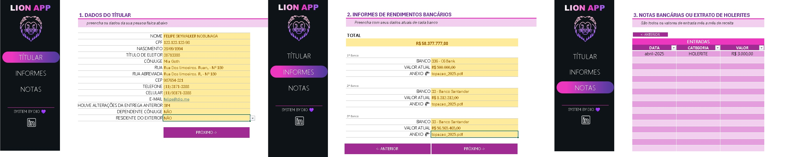
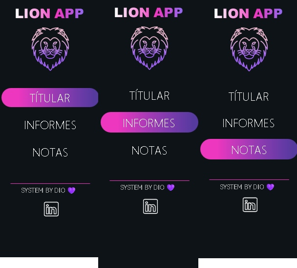

# 🦁 Lion App - Agregador de Dados para Imposto de Renda

Este projeto foi desenvolvido no curso **Santander - Excel com Inteligência Artificial** da **DIO**, sob a coordenação do **Felipão da DIO**. Durante essa jornada, tive **insights incríveis** sobre o poder do **Excel**, explorando funcionalidades avançadas e técnicas inovadoras para organização de dados.

## 📌 Descrição do Desafio

Criar uma ferramenta no **Excel** para facilitar a organização e gestão das informações para a declaração de **imposto de renda**. Com recursos avançados, o usuário pode controlar suas entradas financeiras de forma eficiente e validada.

## 🎯 Objetivos de Aprendizagem

Ao concluir este desafio, pude:
- Utilizar conceitos avançados do **Excel** em um ambiente prático;
- Aprender a **documentar processos técnicos** de forma clara e estruturada;
- Explorar o **GitHub** para versionamento e compartilhamento de documentação técnica, promovendo a colaboração entre desenvolvedores.

## 🖼 Galeria de Imagens

### Imagens das Planilhas

Abaixo, seguem capturas de tela de cada planilha que compõe a solução:

- **Planilha do Projeto:**  
    
  *Visão geral do projeto, mostrando a organização dos dados.*

### Imagem do Menu Interativo

Exemplo do **menu interativo** que possibilita a navegação rápida entre as planilhas:  
  
*Botões clicáveis que trocam de planilha de forma instantânea, proporcionando uma experiência dinâmica e intuitiva.*

## 🔥 Aprendizados e Insights

Participar deste projeto foi **transformador!** Descobri como pequenos detalhes – como formatações automatizadas e validações inteligentes – podem elevar a experiência do usuário. Aprendi a organizar dados de maneira eficaz e explorar recursos avançados do **Excel** além das funções convencionais.

## 🛠 Funcionalidades Relevantes

### Menu Interativo

Essa funcionalidade mudou completamente minha visão sobre o **Excel** e me mostrou como ele pode ser **poderoso e dinâmico**!  
- **Navegação Inteligente:** Botões clicáveis permitem trocar de planilha sem precisar rolar manualmente.  
- **Interface Amigável:** Design intuitivo, com atalhos estratégicos para acesso rápido às seções principais.  
- **Validações Automáticas:** O sistema identifica e corrige erros comuns de preenchimento, garantindo precisão nos dados.  

### Formatações Personalizadas  

As formatações personalizadas facilitaram muito o preenchimento correto dos dados e garantiram maior **padronização**:  
- **CPF:** Formatação automática no padrão `000.000.000-00`.  
- **Telefone:** Máscaras configuráveis para números com ou sem o nono dígito.  
- **Moeda:** Valores exibidos com separação de milhares e símbolo de **R$**.  
- **Datas:** Ajuste automático para o formato `DD/MM/AAAA` OU `MMMM-AAAA`.  

Essas configurações tornaram o preenchimento mais intuitivo, evitando erros manuais e garantindo uma apresentação profissional dos dados.

### Exploração do VBA

Também explorei **VBA (Visual Basic for Applications)** e percebi que o Excel tem **muito mais** funcionalidades do que eu imaginava!  
- **Automação de elementos gráficos:** Usei um código VBA para **posicionar automaticamente** um ícone na mesma posição em **três planilhas diferentes**.  
- **Maior controle sobre imagens:** Esse recurso me mostrou que é possível **editar e manipular objetos gráficos** dentro do Excel de forma eficiente.  

Essa experiência abriu portas para novas explorações dentro do **Excel e VBA**, e com certeza pretendo pesquisar mais sobre isso no futuro! 🔍💡

## 🚀 Tecnologias Utilizadas

- **Microsoft Excel** - Plataforma principal da ferramenta.  
- **VBA** - Para automação e manipulação de elementos gráficos.  
- **GitHub** - Utilizado para versionamento e compartilhamento da documentação técnica.  

## 📚 Informação Adicional - Tabela de Bancos e Códigos

Durante o curso, o **Felipão da DIO** compartilhou uma **planilha extremamente útil** contendo uma tabela com diversos **bancos e seus respectivos códigos (IDs)**. Essa informação facilita a **validação automática dos bancos** ao preencher os informes de rendimento.

### 📂 Planilha de Bancos e Códigos  
A tabela contém:
- **Nome do banco**  
- **Código do banco (ID)**  
- **Classificação e categoria**  

Essa referência rápida permite que os usuários preencham corretamente os dados bancários sem precisar buscar manualmente cada código.

🔗 **[Baixar Planilha de Bancos](./extra/banco_de_apoio.xlsx)**

Essa planilha foi essencial para garantir **precisão nos informes financeiros**, agilizando o preenchimento e minimizando erros!

## 🔗 Como Usar

1. **Baixe o arquivo Excel** principal aqui: **[Baixar Lion App](./lion-app.xlsx)**  
2. **Explore o menu interativo** para navegar entre as seções da ferramenta.  
3. **Preencha os dados** conforme as instruções presentes em cada planilha.  
4. **Utilize os atalhos e as validações automáticas** para garantir um preenchimento correto e eficiente.  
5. **Revise e finalize** sua declaração de imposto de renda.  

## 📖 Contribuição

Quer contribuir para a melhoria desta ferramenta? Siga os seguintes passos:  
1. Faça um **fork** deste repositório.  
2. Crie uma nova **branch** (por exemplo, `feature-nome-da-sua-melhoria`).  
3. Envie um **pull request** com suas sugestões e melhorias.  

---

Desenvolvido com 💡 durante o curso **DIO com Santander**, essa experiência ampliou meus horizontes no **Excel**, permitindo explorar novas possibilidades de **automação e organização de dados**! 🚀  